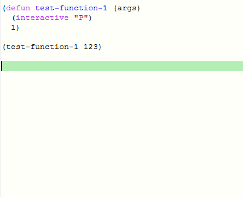

# company-yasnippet-autoparens
A company-mode script for auto-parenthesis

### What problems does company-yasnippet-autoparens solve?

Each Lisp dialect has its own syntax form. Take Scheme as an example, we have special forms (such as ```define```, ```if```, ```let```, ```lambda```),  primitive operators (such as ```con```, ```car```, ```cdr```),  as well as the application of custom procedure.

The special form and the primitive operation are fixed, they can be made into snippet files and added to completion list. However, the custom procedure is not fixed, and it is impossible to make them into snippet files.

Therefore, when you enter ```cons```, ```cons - > (cons E1 e2)`` will appear in the completion list. But when you type ```foo```, there is no ```foo - > (foo e)``` to fill out the list.

company-yasnippet-autoparens is the solution to this problem, it can make ```foo - > (foo e)``` appear in the completion list.

### Demo

1. For any continuous text input, a parentheses version of that text will be added to the completion list.


2. For the original completion items (eg: dabbrev), a corresponding parentheses version will now be added to the completion list.


3. An example of using let and procedure call.



4. An example of using cond and procedure call.


Note: company-yasnippet-autoparens supports any s-exp languages (not just Elisp).

### Usage

0. Install yasnippet

1. If you have installed company, uninstall it.

   The easiest way to do this is remove your company folder (eg: In windows, C:\Users\\%YOU-USERNAME%\AppData\Roaming\\.emacs.d\company-XXXXXXXX.XXXX) and make sure your Emacs configuration doesn't automatically install company.

2. Copy company-20180415.2135 folder to any path which emacs can load (eg: In windows, C:\Users\\%YOU-USERNAME%\AppData\Roaming\\.emacs.d\)

3. Copy company-yasnippet-autoparens.el to any path which emacs can load (eg: In windows, C:\Users\\%YOU-USERNAME%\AppData\Roaming\\.emacs.d\)

4. Add following code to your configuration
```
(require 'company)
(global-company-mode 1)
(setq company-idle-delay 0.1)
(setq company-minimum-prefix-length 1)

;; Add company-dabbrev
(push '(company-capf :with company-dabbrev) company-backends)
(setq company-dabbrev-char-regexp "\\sw\\|_\\|-\\|!\\|\\?\\|*\\|+")

;; Add company-yasnippet
(defvar company-mode/enable-yas t
"Enable yasnippet for all backends.")

;; Add yasnippet support for all company backends
(defun company-mode/backend-with-yas (backend)
(if (or (not company-mode/enable-yas) (and (listp backend) (member 'company-yasnippet backend)))
    backend
  (append (if (consp backend) backend (list backend))
          '(:with company-yasnippet))))

(setq company-backends (mapcar #'company-mode/backend-with-yas company-backends))

;; Add company-yasnippet-autoparens
(defun company-mode/backend-with-yas-ap (backend)
(if (or (not company-mode/enable-yas) (and (listp backend) (member 'company-yasnippet-autoparens backend)))
    backend
  (append (if (consp backend) backend (list backend))
          '(:with company-yasnippet-autoparens))))

(setq company-backends (mapcar #'company-mode/backend-with-yas-ap company-backends))
```
