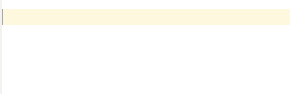

# company-yasnippet-autoparens
A company-mode script for auto-parenthesis

### What problem does company-yasnippet-autoparens solve?

Most of completion systems for Emacs do not support automatic parentheses. For example, by default, when typing `add-ho`, the completion list will show  `add-hook` instead of `(add-hook)`. This is sometimes annoying. The company-yasnippet-autoparens solves the problem, it can make `add-hook - > (add-hook)` appear in the completion list.


### Demo

1. Any text input, a parentheses version will be added to the completion list.


2. Any original completion items (eg: dabbrev), a corresponding parentheses version will be added to the completion list.


3. Some other examples.


Note that company-yasnippet-autoparens supports any s-exp languages, not just Elisp. It even can support non s-exp languages, if using `company-yasnippet-autoparens-2.el`.

4. Non s-exp languages.



   


### Usage

1. Install `yasnippet` if you have not installed.
2. If you have installed `company`, uninstall it.
3. Clone this repository and unzip it to your emacs configuration path.
4. Add the following code to your configuration file.
```
(require 'yasnippet)
(yas-global-mode 1)

(require 'company)
(global-company-mode 1)
(setq company-idle-delay 0.1)
(setq company-minimum-prefix-length 1)
(setq company-dabbrev-char-regexp "\\sw\\|_\\|-\\|!\\|\\?\\|*\\|+")
(setq company-backends '((company-capf
                          company-dabbrev
                          company-yasnippet-autoparens
                          company-yasnippet)))
```


